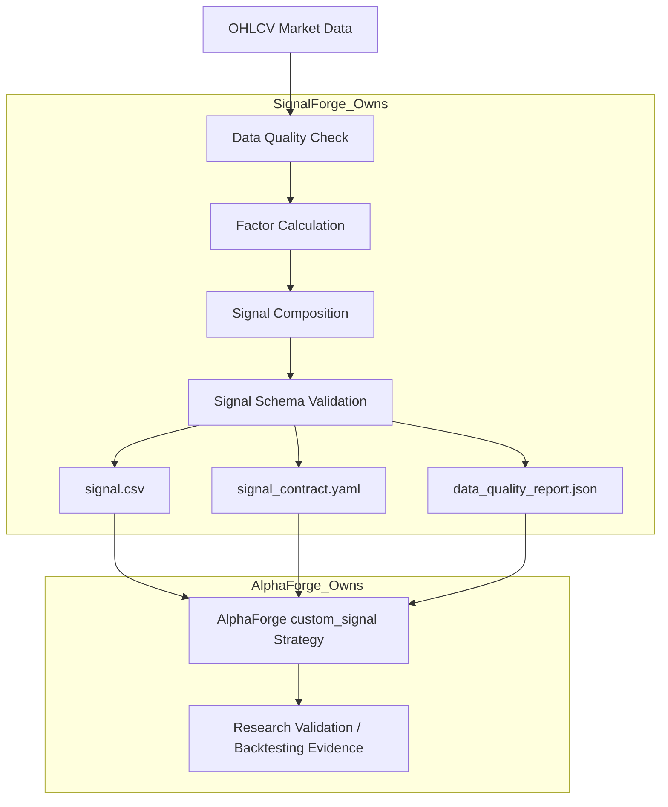
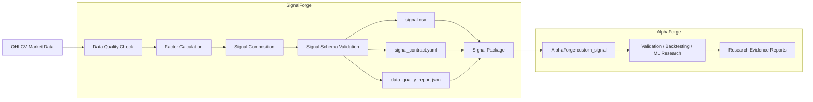

# SignalForge

SignalForge is a deterministic signal-generation layer for quantitative research.
It converts OHLCV market data and factor definitions into standardized,
AlphaForge-compatible signal artifacts.

SignalForge is **not** a backtester. It is the upstream signal factory in my
portfolio: it produces clean signal packages, while AlphaForge performs research
validation, backtesting evidence generation, walk-forward analysis, and reporting.

---

## Portfolio Snapshot

| Area                 | What SignalForge Demonstrates                                        |
| -------------------- | -------------------------------------------------------------------- |
| Quant research       | Paper-derived factor implementation and signal generation            |
| Data engineering     | OHLCV input contracts, data quality reporting, deterministic exports |
| Software engineering | CLI workflow, schema validation, artifact-oriented design            |
| Research hygiene     | Clear separation between signal generation and backtest evaluation   |
| Integration          | AlphaForge-compatible `custom_signal` handoff                        |

---

## What Problem This Solves

Many quant side projects mix factor calculation, signal generation, backtesting,
and performance reporting in one script or notebook.

SignalForge separates one specific responsibility:

> turn market data and factor definitions into validated signal artifacts that
> another research engine can evaluate.

This separation matters because signal generation and strategy validation are
different concerns. SignalForge owns the reproducible creation of signal packages.
AlphaForge owns downstream validation, backtesting evidence, walk-forward
analysis, and final research reports.

---

## System Overview

```text
OHLCV Market Data
  → Data Quality Check
  → Factor Calculation
  → Signal Composition
  → Signal Schema Validation
  → signal.csv
  → signal_contract.yaml
  → data_quality_report.json
  → AlphaForge custom_signal validation
```

SignalForge focuses on deterministic artifact production. The output package is
designed to be inspected directly or consumed by AlphaForge through a file-based
handoff.

---

## Architecture Diagram



---

## Current Capabilities

* Local OHLCV CSV input for signal generation
* Data quality report generation
* Paper-derived factor implementation
* Signal composition
* Deterministic `signal.csv` export
* `signal_contract.yaml` export
* `data_quality_report.json` export
* AlphaForge-compatible signal schema validation
* CLI-based signal generation workflow
* Moskowitz-style time-series momentum MVP factor
* Explicit daily datetime policy for MVP OHLCV signals
* File-based AlphaForge handoff without runtime coupling

---

## Demo: Generate a Signal Package

Prepare an OHLCV CSV file with the required market data columns:

```text
datetime, open, high, low, close, volume
```

Edit the example config:

```text
examples/twse_2330_moskowitz_signal.yaml
```

Run the generator:

```bash
signalforge generate --config examples/twse_2330_moskowitz_signal.yaml --overwrite
```

Or run it as a Python module:

```bash
python -m signalforge.cli generate --config examples/twse_2330_moskowitz_signal.yaml --overwrite
```

Every successful run produces a signal package containing:

```text
signal.csv
signal_contract.yaml
data_quality_report.json
```

---

## Evidence of Engineering Quality

Recommended validation commands:

```bash
python -m pytest
ruff check .
openspec validate --all --strict
```

The repository is designed around deterministic exports and explicit contracts.
Instead of mixing research claims with implementation code, SignalForge produces
reviewable artifacts that can be validated independently.

---

## Boundaries

SignalForge intentionally does **not** provide:

* Backtesting
* Performance metric ranking
* Final holdout evaluation
* Portfolio construction
* Live trading
* Broker execution
* AlphaForge report generation

For these capabilities, use AlphaForge after generating signal artifacts with
SignalForge.

SignalForge produces signal artifacts. AlphaForge remains the validation backend
for backtesting, evidence evaluation, walk-forward analysis, and final holdout
evaluation.

---

## Portfolio Context

SignalForge is the upstream signal-generation layer in my quantitative research
toolchain.

```text
SignalForge
  → generates standardized factor / signal artifacts

AlphaForge
  → validates signals, runs ML experiments, and produces research artifacts

bs_pricer
  → demonstrates financial engineering model implementation

agent-taskflow
  → demonstrates human-gated automation, validation, and proof-of-work workflows
```

Together, these projects show a broader direction:

> building reproducible quantitative research tools with clear engineering
> boundaries, deterministic artifacts, and reviewable evidence.

---

## Architecture Diagram



---

## Installation / Development Setup

```bash
git clone https://github.com/anderson930420/SignalForge.git
cd SignalForge
python -m venv .venv
source .venv/bin/activate
pip install -e ".[dev]"
```

---

## Testing and Validation

```bash
python -m pytest
ruff check .
openspec validate --all --strict
```

---

## Quickstart: Generate a Moskowitz Momentum Signal

1. **Prepare your OHLCV data:**
   Place a CSV file with columns: `datetime`, `open`, `high`, `low`, `close`, `volume`

2. **Configure the signal:**
   Edit `examples/twse_2330_moskowitz_signal.yaml` and update `data_source.path` to point to your OHLCV CSV file.

3. **Run the generator:**
   ```bash
   signalforge generate --config examples/twse_2330_moskowitz_signal.yaml --overwrite
   ```

   Or via Python module:
   ```bash
   python -m signalforge.cli generate --config examples/twse_2330_moskowitz_signal.yaml --overwrite
   ```

---

## Input Data Format

SignalForge accepts local OHLCV CSV files with the following required columns:

| Column   | Description |
|----------|-------------|
| datetime | Declared daily trading-date label for MVP OHLCV signals (ISO 8601 recommended) |
| open     | Opening price |
| high     | Highest price |
| low      | Lowest price |
| close    | Closing price |
| volume   | Trading volume |
| symbol   | Optional if injected via config |

---

## Output Artifacts

Every signal export produces exactly three artifacts in `{artifacts_dir}/{symbol}/{signal_name}/{start_date}_{end_date}/`:

| Artifact | Format | Description |
|----------|--------|-------------|
| signal.csv | CSV | Row-level signal data |
| signal_contract.yaml | YAML | Signal generation metadata |
| data_quality_report.json | JSON | Source OHLCV data quality report |

---

## signal.csv Contract

**Exact column order:**
```
datetime, available_at, symbol, signal_name, signal_value, signal_binary, source
```

**Rules:**
- For MVP daily OHLCV signals, `datetime` is a declared daily trading-date label
- For MVP daily OHLCV signals, `available_at` is also a declared daily trading-date label
- In the OHLCV-only MVP, `available_at` is the same declared trading date as `datetime`
- `available_at <= datetime` is evaluated at daily-date level in MVP
- `signal_binary` contains only 0 or 1
- `signal_binary = 1 if signal_value > 0 else 0`
- Rows sorted deterministically by `datetime, symbol, signal_name`
- No duplicate `(datetime, symbol, signal_name)` rows

**Daily datetime policy:**
SignalForge MVP daily OHLCV artifacts use declared trading-date labels, not intraday event-time availability. SignalForge does not provide intraday timing validation and does not claim point-in-time correctness for non-OHLCV data in MVP. Downstream consumers should align daily signals by declared trading date, not by UTC-shifted instant time. For example, `2025-01-02T00:00:00+08:00` is interpreted as trading date `2025-01-02` for daily-signal alignment.

**Insufficient-history rows:**
Rows where the factor cannot compute a valid value (e.g., warmup period) are dropped before export.

---

## signal_contract.yaml Example

```yaml
signal_name: moskowitz_momentum
version: 0.1.0
source: moskowitz_2024
factor:
  name: moskowitz_momentum
  version: 0.1.0
  parameters:
    lookback_days: 252
decision_rule:
  signal_binary: "1 if signal_value > 0 else 0"
data:
  required_columns:
    - datetime
    - open
    - high
    - low
    - close
    - volume
    - symbol
timing:
  available_at_rule: "same declared daily trading date as datetime for OHLCV-only daily signal"
output:
  file: signal.csv
  schema_version: 0.1.0
  columns:
    - datetime
    - available_at
    - symbol
    - signal_name
    - signal_value
    - signal_binary
    - source
```

---

## data_quality_report.json Example

```json
{
  "version": "1.0",
  "generator": "SignalForge",
  "dataset_name": "path/to/ohlcv.csv",
  "source_type": "local_ohlcv_csv",
  "symbol_count": 1,
  "row_count": 1948,
  "start_date": "2018-01-02T00:00:00+00:00",
  "end_date": "2025-12-31T00:00:00+00:00",
  "duplicate_rows": 0,
  "missing_values": {
    "open": 0,
    "high": 0,
    "low": 0,
    "close": 0,
    "volume": 0
  },
  "warnings": [],
  "point_in_time_correctness_claimed": false
}
```

**Note:** This report describes the source OHLCV market data, not the composed signal dataframe.

---

## Current MVP Factor: Moskowitz Time-Series Momentum

**Formula:**
```
signal_value[t] = close[t - skip_days] / close[t - lookback_days] - 1
```

**Parameters:**
| Parameter | Default | Description |
|-----------|---------|-------------|
| lookback_days | 252 | 12 months of trading days |
| skip_days | 21 | 1 month of trading days |

**Insufficient-history policy:**
Rows where `factor_value` is NaN (due to insufficient lookback data) are dropped before signal composition.

---

## Non-Goals

SignalForge does **not** provide:
- Backtesting
- Performance metric ranking (Sharpe, drawdown, CAGR, etc.)
- Live trading
- Broker execution
- Portfolio construction
- Multi-factor portfolio optimization

For these capabilities, use AlphaForge after generating signal artifacts with SignalForge.

---

## AlphaForge Integration

SignalForge exports signal artifacts that AlphaForge can consume through its `custom_signal` strategy interface:

```bash
alphaforge research-validate --strategy custom_signal --data <market_data.csv> --signal-file <signal.csv>
```

SignalForge does not import AlphaForge at runtime.

For detailed handoff documentation, see [docs/alphaforge_handoff.md](docs/alphaforge_handoff.md).
