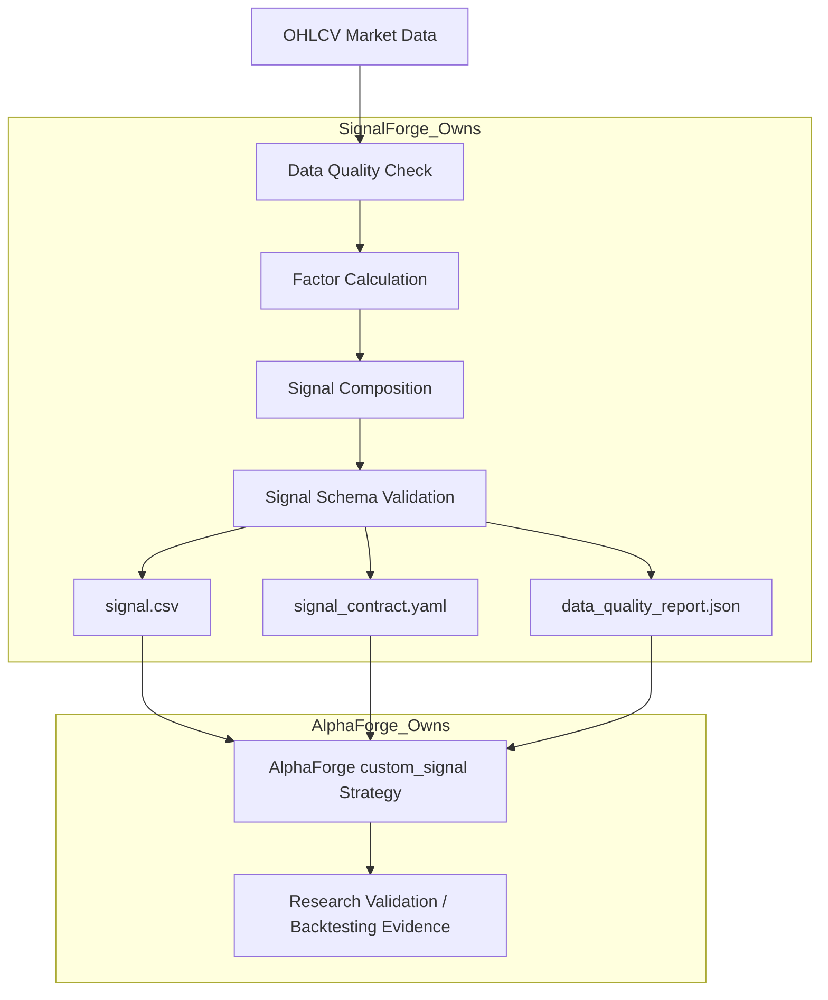

# SignalForge

[English](README.md) | 繁體中文

SignalForge 是一個用於量化研究的 deterministic signal-generation layer。
它負責將 OHLCV 市場資料與因子定義，轉換成標準化、可交給 AlphaForge 驗證的 signal artifacts。

SignalForge **不是**回測器。
它在我的作品集中扮演的是 upstream signal factory：負責產生乾淨、可檢查、可重現的 signal package；AlphaForge 則負責 downstream research validation、backtesting evidence、walk-forward analysis 與 reporting。

---

## 作品集定位

| 面向   | SignalForge 展示的能力                                              |
| ---- | -------------------------------------------------------------- |
| 量化研究 | 將 paper-derived factor 轉換成可執行的 signal generation workflow      |
| 資料工程 | OHLCV input contract、data quality report、deterministic exports |
| 軟體工程 | CLI workflow、schema validation、artifact-oriented design        |
| 研究紀律 | 將 signal generation 與 backtest evaluation 清楚分離                 |
| 系統整合 | 產生 AlphaForge-compatible `custom_signal` artifacts             |

---

## 這個專案解決什麼問題？

許多量化交易 side project 會把以下事情混在同一份 notebook 或 script 裡：

* factor calculation
* signal generation
* backtesting
* performance reporting
* strategy conclusion

這樣雖然可以快速做出一張 equity curve，但很容易造成研究流程不清楚、資料邊界不明確，甚至讓人無法判斷結果是否可重現。

SignalForge 專注於一個明確責任：

> 將市場資料與因子定義，轉換成可驗證、可交接、可被下游研究系統評估的 signal artifacts。

這樣的分工很重要，因為 signal generation 和 strategy validation 是不同問題。
SignalForge 負責可重現地產生 signal package；AlphaForge 則負責後續驗證、回測證據、walk-forward analysis 與研究報告。

---

## 系統流程

```text
OHLCV Market Data
  → Data Quality Check
  → Factor Calculation
  → Signal Composition
  → Signal Schema Validation
  → signal.csv
  → signal_contract.yaml
  → data_quality_report.json
  → AlphaForge custom_signal validation
```

SignalForge 的重點是 deterministic artifact production。
輸出的 signal package 可以被人工直接檢查，也可以透過 file-based handoff 交給 AlphaForge 做 downstream validation。

---

## 架構圖



---

## 目前能力

* Local OHLCV CSV input for signal generation
* Data quality report generation
* Paper-derived factor implementation
* Signal composition
* Deterministic `signal.csv` export
* `signal_contract.yaml` export
* `data_quality_report.json` export
* AlphaForge-compatible signal schema validation
* CLI-based signal generation workflow
* Moskowitz-style time-series momentum MVP factor
* Explicit daily datetime policy for MVP OHLCV signals
* File-based AlphaForge handoff without runtime coupling

---

## Demo：產生 Signal Package

準備一份 OHLCV CSV，包含必要欄位：

```text
datetime, open, high, low, close, volume
```

編輯範例 config：

```text
examples/twse_2330_moskowitz_signal.yaml
```

執行 generator：

```bash
signalforge generate --config examples/twse_2330_moskowitz_signal.yaml --overwrite
```

或使用 Python module 執行：

```bash
python -m signalforge.cli generate --config examples/twse_2330_moskowitz_signal.yaml --overwrite
```

每次成功執行會產生一個 signal package：

```text
signal.csv
signal_contract.yaml
data_quality_report.json
```

---

## 輸出 artifacts

SignalForge 每次 export 都會產生三個核心 artifacts：

| Artifact                   | 格式   | 說明                                    |
| -------------------------- | ---- | ------------------------------------- |
| `signal.csv`               | CSV  | row-level signal data                 |
| `signal_contract.yaml`     | YAML | signal generation metadata 與 contract |
| `data_quality_report.json` | JSON | source OHLCV data quality report      |

這些 artifacts 的目的不是直接宣稱策略有效，而是讓下游研究流程可以清楚檢查：

* 訊號如何產生
* 資料品質是否合理
* schema 是否符合約定
* 是否可以交給 AlphaForge 做 research validation

---

## 工程品質證據

建議驗證指令：

```bash
python -m pytest
ruff check .
openspec validate --all --strict
```

SignalForge 採用 artifact-oriented design。
它不把研究結論直接混在產生訊號的程式裡，而是輸出可被獨立檢查的 artifacts，讓 downstream research engine 進一步驗證。

---

## 專案邊界

SignalForge 不提供：

* Backtesting
* Performance metric ranking
* Final holdout evaluation
* Portfolio construction
* Live trading
* Broker execution
* AlphaForge report generation

這些能力由 AlphaForge 在 signal artifacts 產生後負責。

SignalForge 的核心責任是：

> 產生乾淨、標準化、可交接的 signal artifacts。

AlphaForge 則是 validation backend，負責 backtesting、evidence evaluation、walk-forward analysis 與 final holdout evaluation。

---

## 與其他作品的關係

SignalForge 是我量化研究工具鏈中的 upstream signal-generation layer。

```text
SignalForge
  → 產生標準化 factor / signal artifacts

AlphaForge
  → 驗證 signals、執行 ML experiments、產出 research artifacts

bs_pricer
  → 展示金融工程模型實作能力

agent-taskflow
  → 展示 human-gated automation、validation、proof-of-work workflow 設計能力
```

這四個作品共同呈現的方向是：

> 建立具備清楚工程邊界、deterministic artifacts、可測試性與可審查證據的量化研究工具鏈。
